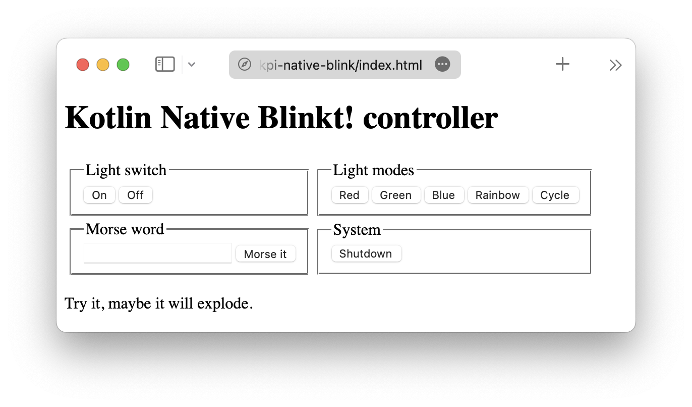

# Kpi.KBlinkt

> A simple program to understand how to work with Kotlin Native to access GPIO pins on a Raspberry Pi. It also features a Ktor-based web interface in addition to just using `curl`. Developed using [JetBrains Fleet](https://www.jetbrains.com/de-de/fleet/).

## tl;dr

KPi.Blinkt is a sample how to use Kotlin Native on a Raspberry Pi to access and control attached Blinkt HATs using the GPIO
connector. It's build on top of the [ktgpio](https://github.com/ktgpio/ktgpio/) library.

In many parts, this is a port of
my [HomeBear.Blinkt](https://github.com/tscholze/dotnet-iot-homebear-blinkt/tree/master/HomeBear.Blinkt/Controller)
Windows 10 IoT C# app I wrote times ago. I used in a few cases ChatGPD to convert my C# code into Kotlin one which worked very well.

## Build status
|Service|Status|
|-|-|
|GitHub|[](https://github.com/tscholze/kotlin-kpi-native-blinkt/actions/workflows/gradle.yml)|

## Required Hardware

- 64bit Raspberry Pi (Model 3B and later)
- [Pimoroni Blinkt!](https://shop.pimoroni.com/products/blinkt) Raspberry Pi HAT with 8x APA102 pixels

## Required Software

- Windows, Mac or Linux host
- Installed SSH client, mostly build into the host OS
- Raspbian 64bit or other Raspberry Pi OS with GPIO libaries
- [JetBrains Fleet](https://www.jetbrains.com/de-de/fleet/), IntelliJ (Community) or similar to edit Kotlin code

## How to run

Open the `build_deploy.start.sh` file, edit `PI_HOST` property and click the play symbol on the first line of the file.

## Available web interface

After booting up the app, you can connect to `http://pi:8080/` and control the Blinkt! HAT using your browser.



## Available `curl` commands

After the server has been started, the following commands are available:

```shell
# Turn off all the things
curl -X POST http://pi:8080/on
curl -X POST http://pi:8080/off

# Light mode sample
# See `turnLightMode` for more supported ids
curl -X POST http://pi:8080/lightmode -d "red"
curl -X POST http://pi:8080/lightmode -d "rainbow"
curl -X POST http://pi:8080/lightmode -d "cycle"

# Morse word
curl -X POST http://pi:8080/morse -d "hello"

# System shutdown
curl -X POST http://pi:8080/shutdown
```

## Features

- [x] Project setup
- [x] Deployment to a Pi using a convenient shell script
- [x] Control APA102 based LEDs using Kotlin functions
- [x] Add "plugin"-system for light modes
- [x] Control LEDs using remote computer's `curl` commands
- [x] Control LEDs using a simple web interface

## How it looks

Please click to watch.
[](https://youtu.be/TJObdr6nuBI)

## Publications

- Hackster.io [post](https://www.hackster.io/tscholze/kblinkt-kotlin-native-program-to-control-a-blinkt-hat-1f8208)


## Contributing

Feel free to improve the quality of the code. It would be great to learn more from experienced Kotlin and IoT
developers.

## Authors

- Me [(Tobi)]([https://tscholze.github.io) as main developer
- [Sebastian Aigner from JetBrains](https://github.com/SebastianAigner) for fixing his own name

## Special thanks to

BitSpittle, CharLEE, Clovis and TheDome from the [Kobweb Discord](https://discord.com/invite/5NZ2GKV5Cs) to support
Kotlin beginners like me. As well as Sebastian Aigner from JetBrains to get me back into Kotlin with his Twitch Streams.

## License

This project is licensed under the MIT License - see the [LICENSE](LICENSE.md) file for details.
Dependencies or assets maybe licensed differently.
